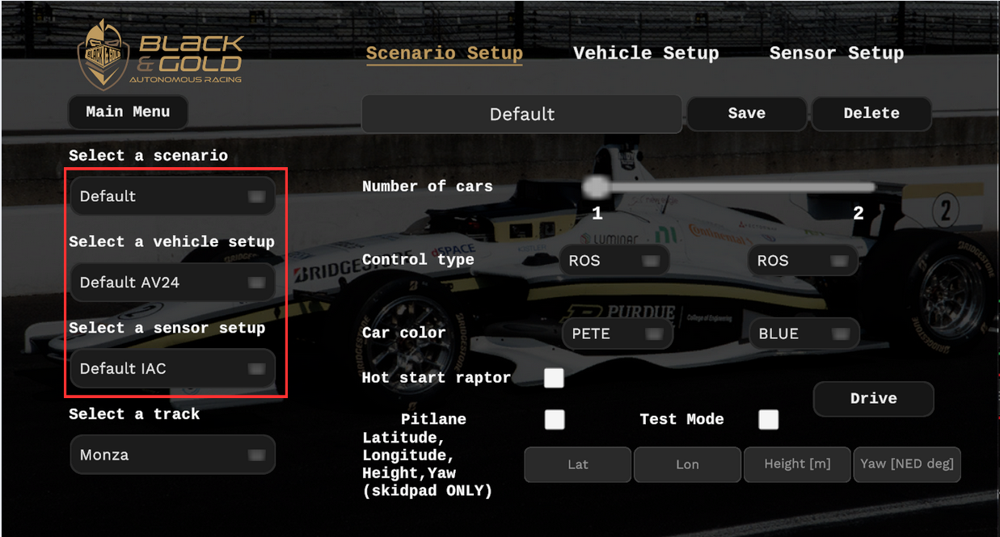
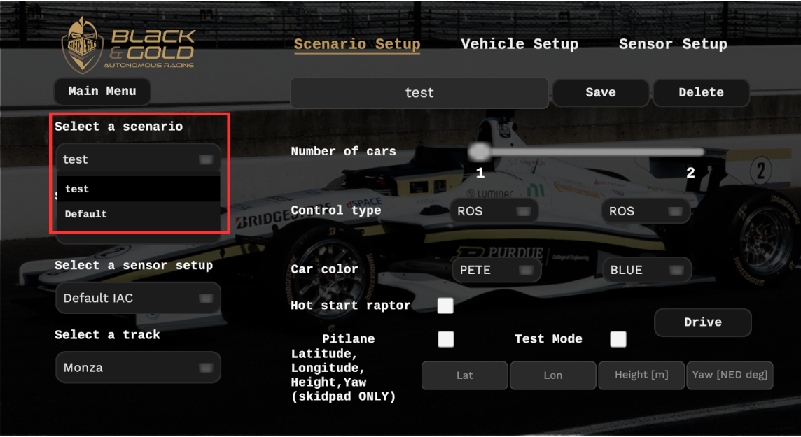

# How to Use Racing Simulator

A vehicle simulator for the Dallara AV-24. This simulator improves upon the original AWSIM developed by Autoware, and provides a high-fidelity testbed validated against real-world data. Purdue-AI-Racing-Simulator (PAIRSIM) interfaces with an autonomy stack to allow for testing of autonomous racing software with similar dynamics, sensors, and interface to the real car.

## Documentation
1. How to use racing simulator (this page)

2. [ROS2 Interface](RacingSim/ROS2Interface/index.md)

2. [Vehicle dynamics details](RacingSim/VehicleDynamics/index.md)

3. [Sensor details](RacingSim/Sensors/index.md)

## Downloading Simulator

There are two options to run racing simulations:

1. Download binary (recommended)

    Download the most recent racing simulator [here](https://purdue0-my.sharepoint.com/my?id=%2Fpersonal%2Fye372%5Fpurdue%5Fedu%2FDocuments%2FResearch%2Fcustom%5Fsimulator&ga=1)
    
- Currently only compatible with Linux:

    - Double-click the downloaded executable (.so)

    - The first time you may need to set the executable permissions with ```chmod +x PAIRSIM_vX.X.X.so```

2. From the Unity Editor

    a. To run directly from the Unity editor, clone the repository and make sure you are on the `main` git branch.
    
    b. Follow the instructions in [Getting Started - Setup Unity Project](GettingStarted/SetupUnityProject/index.md).

    c. Download and import `.unitypackage` files

    [Download racetrack assets (unitypackage)](https://purdue0-my.sharepoint.com/:f:/g/personal/ye372_purdue_edu/EgUWzDfIwmtFgmzdY9WvvuwBONARgFEiRZvseWVwBZEYpw?e=lvH8AO){.md-button .md-button--primary}

    e. In Unity Editor, from the menu bar at the top, select `Assets -> Import Package -> Custom Package...` and navigate to each `.unitypackage` file. Ensure that you import each unity package, or the corresponding track will not be available after building your Unity project.

<!--  -->

## Scenario Setup (via GUI)

In the main menu, click the 'Scenario Setup' button.

- Select a saved scenario from the dropdown or create a new one (scenario and vehicle setups are saved by default in your ~/PAIRSIM_config folder (Further Vehicle/Tire Parameter Configuration))
- Select a saved vehicle setup
- Select a racetrack
- In the scenario setup, you can select number of cars and their colors (check out the custom Purdue Pete skin)
    - You can name your scenario and save it to use the same scenario settings later
    - When you have multiple scenarios saved, you can pick one from the left dropdown menu
    - The most recently saved scenario will be at the top of the dropdown for convenient testing
    - You can overwrite an existing configuration file of the same name
- The option to "Hot start raptor" will start the low level ECU in sys_state = 9 (as explained in [Sensors - Raptor](../Sensors/index.md))

## Vehicle Setup (via GUI)
To view or create a setup, click the 'Vehicle Setup' button.

- Modify an existing setup or save a new one with the 'Save' button
- To fill in suggested values, press the 'Default' button
- Differential
    - Choose between a spool differential and a Limited Slip Differential (LSD)
- Steering
    - Choose between realistic or ideal steering actuation
    - Set the desired pure steering delay (s) and steering bandwidth (hz)
    - Set the max steering motor angle (deg) and max steering motor rate (deg/s)
    - Set the steering ratio
- Suspension
    - Set the anti-roll bar rates (N/m)
- Brakes
    - Set the brake constant (conversion from kPa to Nm of torque)
- Tires
    - Enable or disable thermal tire effects
    - Set ambient and track temperatures (Celsius)

## Sensor Setup (via GUI)

PAIRSIM has input fields under sensor setup to configure the gaussian noise values of the corresponding actuator/sensor values. (Default values are 0.0)

You can disable sensors or actuators to simulate faults.


## Further Vehicle/Tire Parameter configuration (via config files)

### PART I. Loading Setup Configuration Files via GUI
Previously discussed was how to use the dropdowns on the left side of the PAIRSIM GUI to access configuration files (by default saved in ~/PAIRSIM_config)



Note: Configuration files are saved seperately for Scenario/Vehicle/Sensor setups

### PART II. Editing Configuration Files Directly

Configuration file structure is created by default everytime PAIRSIM is run in `~/PAIRSIM_config`
The default file structure (recommended) is created as follows:

```
~/PAIRSIM_config
├── Parameters
├── Scenarios
│   └── Default.dat
├── SensorSets
│   └── Default IAC.dat
└── VehicleSetups
    └── Default AV24.dat
```

`.dat` files are human-readable and can be edited directly. To add a new `test.dat` scenario configuration file, simply create the file as follows:

```
~/PAIRSIM_config
├── Parameters
├── Scenarios
|   ├── Default.dat
│   └── test.dat
├── SensorSets
│   └── Default IAC.dat
└── VehicleSetups
    └── Default AV24.dat
```

Ensure that the "Name": section is the name of the configuration you want to see appear in the PAIRSIM GUI dropdown:


Return to the main menu and then go back to Scenario Setup. This will appear in the PAIRSIM GUI as:


!!! warning

    - If you edit config files externally, you may need to restart PAIRSIM executable or go back to main menu from the Drive scene to see the changes reflect.
    
    - Also, the setup configuration parameters that cannot be changed directly via the GUI are still yet to be implemented; leave those in their default values.

### PART III: Additional Aero/Suspension/Brake/Geometric Parameter Configuration 

The main vehicle parameters can be changed under "Vehicle Setup".
Due to the large number of vehicle/tire parameters, they are not accessible through the PAIRSIM GUI. Instead they need to be directly changed via their configuration files. The default vehicle parameter file structure is as follows: 

```
~/PAIRSIM_config
├── Parameters
│   ├── AeroParams.json
│   ├── BrakeParams.json
│   ├── EngineParams.json
│   ├── FrontAxleTireParams.json
│   ├── GeometricParams.json
│   ├── RearAxleTireParams.json
│   └── SuspensionParams.json
```

!!! warning

    - You may add additional json files but PAIRSIM will only read from the default file names listed above. You must directly change those files to see changes update. To update the simulation with new parameters either return to the main menu or hit Pause -> Restart
    
    - Ensure that you do not use decimal numbers for parameters that were originally integers or vice-versa
    
    - See `VehicleParameters.cs` and `TyreParameters.cs` in the source code of PAIRSIM for parameter units and default values in case you forget.


## Simulation operation
To start a simulation, click 'Drive' from the 'Scenario Setup' menu.


- 'C' cycles through various camera angles
- Pause button -> Restart button relaunches the entire scenario
- The HUD shows steering motor input, throttle input, brake input, current gear, speed, rpm, ct_state, sys_state, tire tempuratures, and lap times.
- Inject Steering Disturbance button mimics realistic pulse of steering noise seen in real-life AV24 low-level actuator


### When not recieving input data from ROS environment
- Controls are 'arrow keys' or 'WASD' for throttle, steering and brake (must hold)
- 'tab' for gear up
- 'caps lock' or 'shift' for gear down

### When running external autonomy stack in ROS environment
- You can continue with standard AV24 startup proceedure
    - If you selected 'Raptor Hot Start' then you can immediately begin driving
    - If you did not, vehicle requires an orange flag and a ct_state = 5, followed by removing the orange flag to begin driving.
    - Low-level state machine is described in more detail in the [Sensors - Raptor](RacingSim/Sensors/index.md) section.

## Copyright and License

Copyright 2024 Purdue AI Racing

All code is licensed under the Apache 2.0 License. All assets are distributed under the CC BY-NC License.
